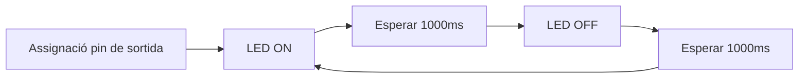

# PRACTICA 1  :  BLINK

## Informe


**Codi utilitzat:**

```c
#include <Arduino.h>
#define LED_BUILTIN 23
#define DELAY 1000

void setup() {
  Serial.begin(115200);
  pinMode(LED_BUILTIN, OUTPUT);

}

void loop() {
  digitalWrite(LED_BUILTIN, HIGH);
  Serial.println("ON");
  delay(DELAY);
  digitalWrite(LED_BUILTIN, LOW);
  Serial.println("OFF");
  delay(DELAY);
}
```

**Diagrama de flux:**


El temps lliure que te el processador en aquest cas es de 1 s ja que el delay és de 1000 ms.
